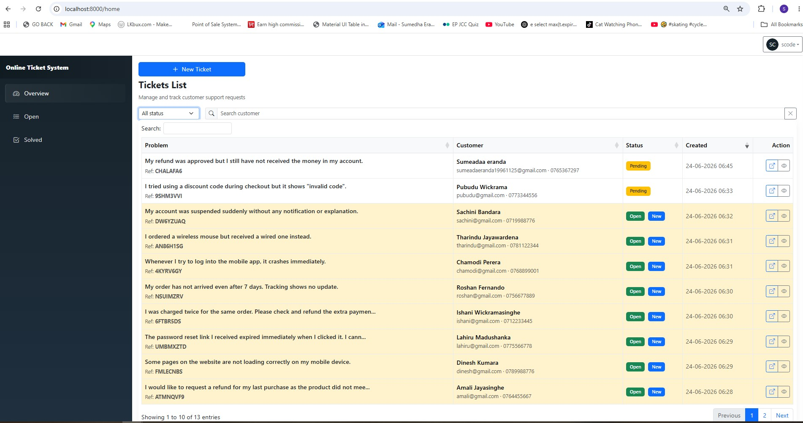
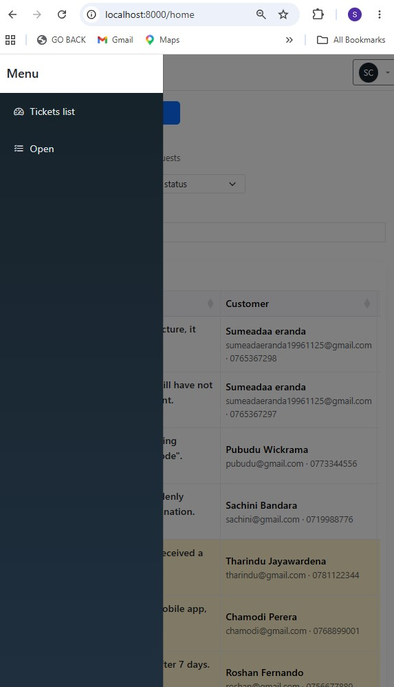
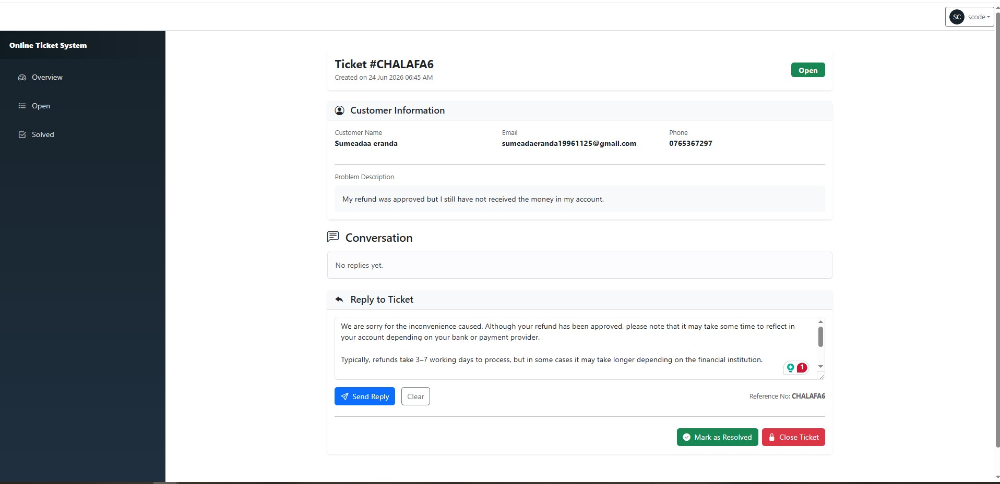
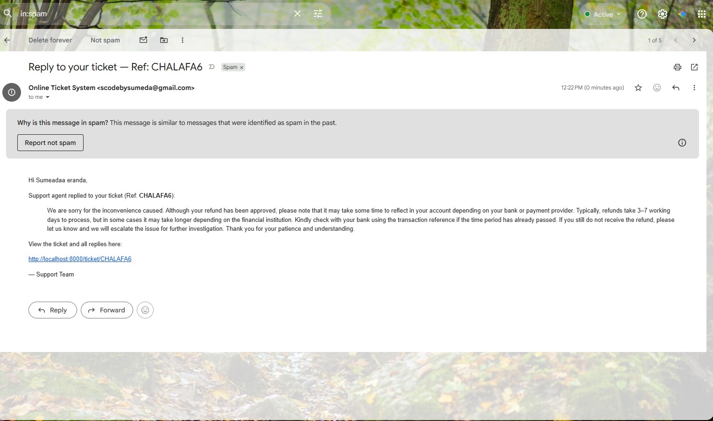
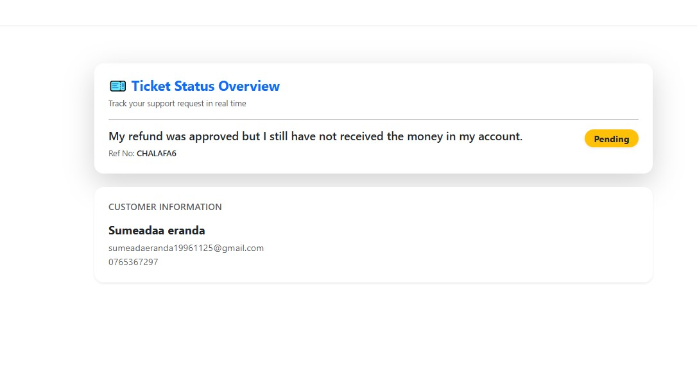
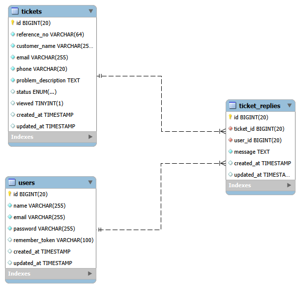
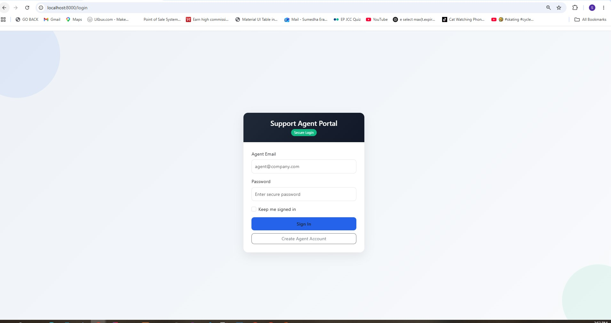

# 🎫 Online Support Ticket System

## 📖 Project Overview

The **Online Support Ticket System** is a Laravel-based web application that allows customers (including guest users) to raise support tickets for product or service-related issues. Support agents can manage, reply, and track tickets through a secure dashboard.

Each ticket is assigned a **unique reference number**, which customers can use to check the status of their request without logging in.

---

## 🚀 Features

### 👤 Guest / Customer Features

* Create a support ticket without login
* Submit the following details:
* Customer Name
* Email Address
* Phone Number
* Problem Description


* Receive a **unique ticket reference number**
* Get **automatic email confirmation** after submission
* Check ticket status using the reference number
* View support agent replies

---

### Support Agent Features

* Secure login system for agents
* View all submitted tickets
* View **pending / new tickets**
* Search tickets by customer name
* Pagination support for ticket listing
* Highlight unread/new tickets
* Open ticket details page
* Reply to tickets
* Send reply email automatically to customer

---

## ⚙️ Functional Requirements Implementation

1. Any user can create a support ticket
2. Guest users can submit ticket with required details
3. System generates a **unique reference number** 4. Email confirmation sent after ticket creation
4. Agents can view pending tickets after login
5. Ticket listing supports search, pagination, and status highlighting
6. Agents can reply to tickets
7. Replies are saved and emailed to customer
8. Customers can check status using reference number
9. Ticket replies are visible in customer view

---

## 📱 Non-Functional Requirements

* Responsive UI (Mobile / Desktop)
* Fast interaction using AJAX where applicable
* input validation on all forms
* Secure handling of user data and ticket references
* Ticket reference numbers are hard to guess (secure random generation)
* Built using Laravel best practices and MVC structure

---

## 🛠️ Tech Stack

* Laravel Framework
* MySQL
* Bootstrap 5 (Responsive UI)
* AJAX (for dynamic updates)
* SweetAlert2 (for alerts/notifications)
* SMTP Email Service

---

## 📸 Screenshots

### 🖥️ Desktop View


---
### 📱 Mobile View

---

### 🎫 Ticket Creation Page

url:- http://localhost:8000/

.jpg)

---

### 📩 Ticket Reply View


---

### 📩 Send email to customer 


---

### 📩 Ticket Status View


---

## 🧪 How to Run the Project (Local Setup)

**1. Clone the Repository**

```bash
git clone https://github.com/your-username/support-ticket-system.git
cd support-ticket-system

```

**2. Database Setup**

Create a MySQL database named:
`support_ticket_system`

Import the provided SQL file:
`Database Tables.sql`

**3. Database ER Diagram**



**4. Install Dependencies**

```bash
composer install
npm install
npm run dev

```

**5. Configure Environment**

Create .env file and paste

```env
DB_DATABASE=online_ticket_system
DB_USERNAME=root
DB_PASSWORD=

APP_NAME=Laravel
APP_ENV=local
APP_KEY=
APP_DEBUG=true
APP_URL=http://localhost


MAIL_MAILER=smtp
MAIL_HOST=smtp.gmail.com
MAIL_PORT=587
MAIL_USERNAME=your email
MAIL_PASSWORD=password
MAIL_ENCRYPTION=tls
MAIL_FROM_ADDRESS=your email
MAIL_FROM_NAME="Online Ticket System"

```

Update the database and mail configuration:

**6. Generate Application Key**

* `php artisan key:generate`
* Then add the `APP_KEY=`

**7. Run Database Migrations**

```bash
php artisan migrate

```

**8. Start the Development Server**

```bash
php artisan serve

```

**9. The application will be available at**


`http://localhost:8000/login`

### Support Agent Portal 


---

## Security Features

* Secure random ticket reference numbers
* Authentication for support agents
* Form input validation
* CSRF protection
* Protected routes and middleware
* Eloquent ORM protection against SQL injection

## Assumptions

* Guest users can create support tickets without logging in.
* A single ticket can have multiple replies.
* SMTP email service is properly configured.
* Customers access their tickets using the generated reference number.
* Support agents manage tickets through a secured dashboard.
